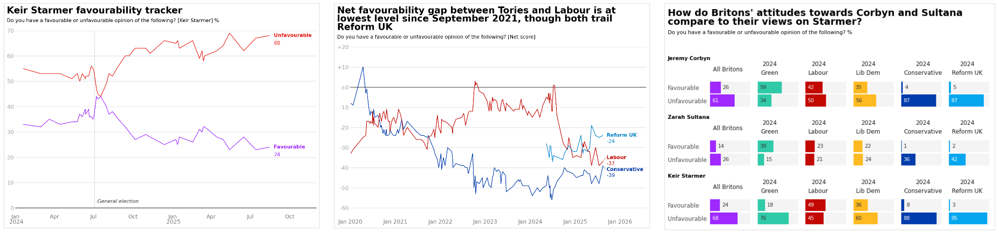

<h2 align="center">
 Posit `plotnine` Contest 2025 Submission
</h2>
<h1 align="center">
"<a href="https://jack-davison.github.io/posit-plotnine-contest-2025/">YouGov Visualisations in Python</a>"<br>Recreating Political Favourability Graphics with <code>plotnine</code>
</h1>

<a href="https://jack-davison.github.io/posit-plotnine-contest-2025/"><div align="center"></div></a>

<div align="center"><b><a href="https://jack-davison.github.io/posit-plotnine-contest-2025/">[View Submission]</a></b></div>

## ℹ️ Purpose

This submission includes attempted one-to-one recreations of the visualisations in ["Net favourability gap between Conservatives and Labour smallest in nearly four years"](https://yougov.co.uk/politics/articles/52795-political-favourability-ratings-august-2025) in Python and plotnine, originally published by [Dylan Difford](https://yougov.co.uk/people/dylan.difford), a Junior Data Journalist at YouGov, on August 19, 2025.

All of the plots are built using [`plotnine`](https://plotnine.org/), an implementatin of R's `{ggplot2}` package in Python. 

This submission shows how examples of effective data visualisation found "in-the-wild" can be recreated with the `plotnine` package. It also contains some surprises I found and reflections I had as an R user who only infrequently works in Python.

## 🗃️ The Repository

The code in this repository is completely reproducible, and builds a [quarto](https://quarto.org/) HTML page with all of the plots contained within. Ensure you have [uv](https://docs.astral.sh/uv/) installed, then run the below commands to create a Python virtual environment and render the content.

```bash
uv sync
uv run quarto render
```

Note that no extraneous data is required to reproduce the plots; all data is contained within this repository in CSV files.

## 👋 About the Author
**I am a senior consultant and data analyst working for an Environmental Consultancy in South Oxfordshire in the United Kingdom.** My work typically involves writing dynamic reports, creating effective data visualisations, authoring Shiny web apps, writing and maintaining R packages, facilitating training workshops, and otherwise writing code to do interesting things with data. I'm a collaborator on the [{openair} project](https://github.com/davidcarslaw/openair) and the lead developer on the [{openairmaps}](https://github.com/davidcarslaw/openairmaps) R package. My main programming language is **R**, but I dabble in Python and JavaScript.

<div align = "center">
 &nbsp;&nbsp;&nbsp;🏠 <a href="https://jack-davison.github.io/">Website<a>&nbsp;&nbsp;&nbsp;
 •
 &nbsp;&nbsp;&nbsp;🦋 <a href="https://bsky.app/profile/jack-davison.bsky.social">Bluesky<a>&nbsp;&nbsp;&nbsp;
 •
 &nbsp;&nbsp;&nbsp;💼 <a href="https://www.linkedin.com/in/jack-davison/">LinkedIn<a>&nbsp;&nbsp;&nbsp;
 •
 &nbsp;&nbsp;&nbsp; <a href="https://orcid.org/0000-0003-2653-6615/">ORCID<a>&nbsp;&nbsp;&nbsp;
</div>